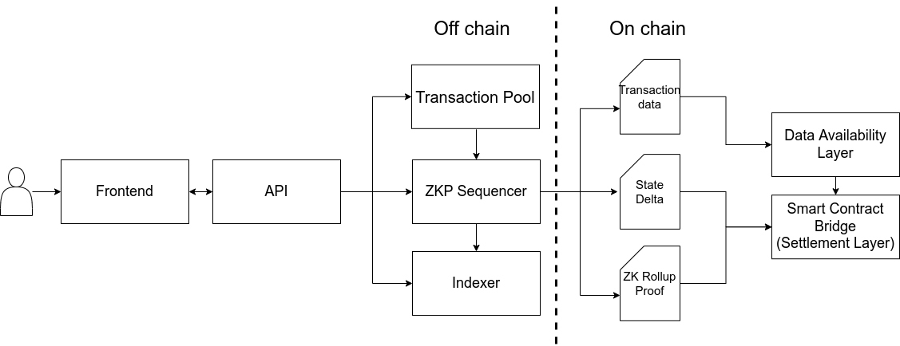

# Mina Snapp

Mina swap is a ZK rollup based constant product AMM decentralised exchange.
Mina swap provides a non-custodial, scalable platform for trustlessly
exchanging tokens.

Mina swap is a L2 scaling solution that utilises a ZK rollup architecture.
In this architecture funds are held and maintained in an on-chain smart contract.
Computation of transactions and state transitions happens off-chain. This is achieved
by combining transactions into a block for which a ZK rollup proof is generated to
attest to the integrity of the applied state transitions. The state deltas and
associated ZK rollup proof are then posted to the on-chain smart contract.
Due to the achitecture of this solution the system achieves the following properties:

- non-custodial and therefore rollup operators can not steal funds
- scalable as transactions are processed off-chain
- based on validity proofs and therefore a quick withdrawal time
- escape hatch provided to withdraw funds from on-chain contract if operator stops cooperating

## Architecture



## DEX Design Specification

### Data Model

Mina swap has two core data structres that constitutes its state, these are:

- Account merkle tree
- Pair merkle tree

#### Account Merkle Tree

The account merkle tree is used to store balances associated with a user account.
The account merkle tree has a depth of 24 providing capacity for 16777216 accounts.
The balances merkle tree has a depth of 10 providing capacity for 1024 token balances
per user acccount. The table below illustrates the account model.

| Name      | Type                             |
| --------- | -------------------------------- |
| publicKey | PublicKey                        |
| nonce     | UInt32                           |
| balances  | KeyedMerkleTree<TokenId, UInt64> |

#### Pair Merkle Tree

The pair merkle tree is used to store information associated with swap pairs.
The pair merkle tree has a depth of 16 providing capacity for 65536 pairs.
The table below illustrates the pair model.

| Name          | Type   |
| ------------- | ------ |
| pairId        | UInt32 |
| token0Id      | UInt32 |
| token1Id      | UInt32 |
| reserve0      | UInt64 |
| reserve1      | UInt64 |
| lpTokenId     | UInt32 |
| lpTotalAmount | UInt64 |

### Logic Overview

Mina swap is a liqudity pool based constant product automated market maker decentralised exchange.
That is to say that the liqudity pool satisfies the invariant

```
(x_1-0.003*x_in) * y_1 >= x_0*y_0
```

where `x_0`, `y_0` are the initial reserve balances of asset X and Y respsectively,
`x_in` is the amount of asset X that the user would like to swap, `x_1` and `y_1`
are the final reserve balances of asset X and Y respectively.

### Branches

Mina swap has three core branches / methods. These are:

- swap
- mint
- burn

#### Swap

The swap branch allows users to swap one token for another. An industry standard 0.3% protocol fee is
charged per swap. Of the 0.3%, liqudity providers receive 0.25% and the operator receives 0.05%.

## How to build

```sh
npm run build
```

## How to run tests

```sh
npm run test
npm run testw # watch mode
```

## How to run coverage

```sh
npm run coverage
```

## License

[Apache-2.0](LICENSE)
